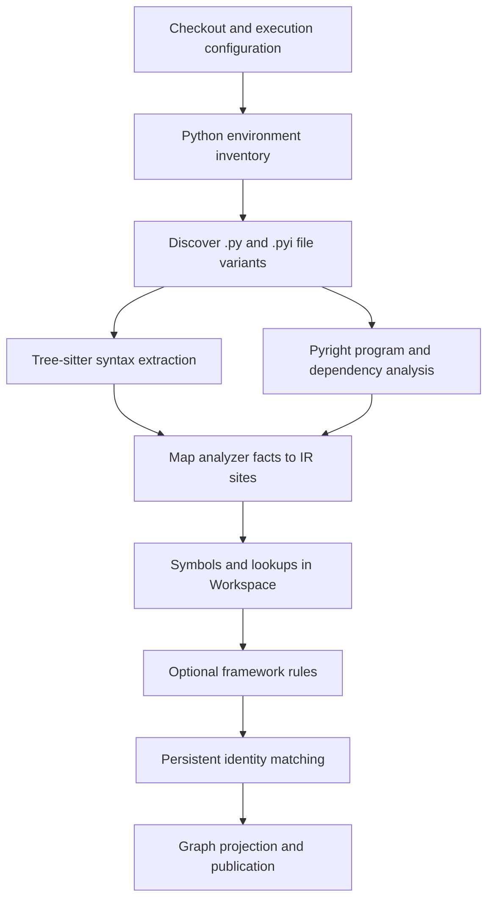

# Python application ingestion and graph resolution

Status: initial implementation delivered. See [Python ingestion](python-ingestion.md)
for setup, supported behavior, validation and remaining boundaries. This document
retains the broader target design; not every phase below is implemented.

## Recommendation

Build Python as another `languages.Adapter`, with a Tree-sitter syntax parser,
a pinned Python environment inventory, and a Pyright-backed semantic resolver.
Keep Go responsible for orchestration, identities and graph publication. Use
the analyzer for binding and type inference; do not build a second Python type
checker in Go.

The target is Java's standard of evidence: accurate static relationships,
reproducible inputs, exact source locations, useful external symbols and honest
unresolved results. Python's dynamic features prevent a general promise that
every call has one statically identifiable implementation.

## 1. What we should copy from Java

The current [Java parser](../internal/parser/java/README.md)
extracts syntax; the [javac resolver](../internal/resolve/java/README.md)
attributes it against verified compilation inputs. They share the generic
`semantic.Workspace`, matcher and projector.

The ADK Java report (in the ei-aitiger-codegraph repository) records
208,925 resolved lookups across 597 file variants. Of those edges, 51.3% target
external symbols and 45.4% target repository declarations. External dependency
resolution is therefore a core requirement, not an optional finishing step.
The report also excludes some occurrence categories from its lookup denominator.
Its 100% figure measures static binding coverage, not runtime dispatch coverage
or an independent precision audit.

| Java component | Python counterpart |
| --- | --- |
| Maven build and classpaths | Explicit interpreter/platform and dependency environment |
| Tree-sitter Java to IR | Tree-sitter Python to IR |
| `JavacTask.analyze()` bridge | Pyright analysis bridge |
| JDK/JAR symbols | Versioned stdlib stubs, package stubs and package source symbols |
| Compiler-generated members | Analyzer-established dataclass and other synthesized members |
| Compiler diagnostics | Analyzer diagnostics and explicit dynamic-analysis limitations |
| Matcher, projector, generation publication | Reuse the existing components with the extensions below |



## 2. Environment discovery: Python's equivalent of the classpath

Create one analysis context per distinct execution environment, not necessarily
one per directory. An application and its tests may share a context; conflicting
dependency sets, platforms or import roots require separate contexts. The same
source path can have multiple context-specific variants.

Record and fingerprint:

- Python implementation, target version and platform; analyzer, bridge and
  grammar versions; typeshed revision; analysis settings and framework rules.
- Ordered import roots, working directory/entrypoint assumptions, source and
  generated roots, workspace packages and explicit editable-install mappings.
- Exact distribution versions, artifact hashes, installed analysis-relevant
  contents, dependency markers, extras and selected dependency groups.
- `.pyi` stubs, `py.typed`, stub-package versions and their association with
  the runtime distributions they describe.
- Project manifests, selected lockfile, effective configuration and unresolved
  input gaps. A `requires-python` range alone does not select a target version.

Provide two preparation modes:

1. **Explicit environment:** read a supplied manifest and mounted dependencies.
   This is the first implementation because its inputs are easiest to verify.
2. **Prepared environment:** discover `pyproject.toml`, lockfiles, requirements
   and workspace metadata, then prepare the selected environment in an isolated
   build stage. If inputs do not identify a reproducible solution, seal an
   incomplete context with the actual resolved inputs and the remaining gaps.

Read legacy `setup.cfg` and literal metadata where supported. Do not execute
`setup.py`, project imports, editable import hooks or build backends during
discovery or semantic analysis. Builds needing code execution belong in the
separate preparation stage. Prevent analyzer fallback to the worker's ambient
Python installation; explicitly supply the permitted filesystem and paths.

Delegate import semantics to the analyzer and record its effective search
order. Pyright documents distinct handling of workspace roots, installed
packages, stubs and library source, and cannot resolve arbitrary executable
editable import hooks. A deployment-fidelity mode should reject or flag
convenience search paths that differ from the declared launch environment.
[Pyright import resolution](https://github.com/microsoft/pyright/blob/main/docs/import-resolution.md)

Maintain a distribution-to-module ownership map: an import name need not equal
the distribution name, and namespace packages can span distributions. Resolve
aliases and re-exports to their actual declaration while preserving the import
site and public alias as evidence. A missing package stays a missing dependency;
do not manufacture all of its possible members as resolved external symbols.

## 3. Syntax parser and IR changes

Implement `internal/parser/python` using a pinned
[Tree-sitter Python grammar](https://github.com/tree-sitter/tree-sitter-python).
Follow Java's per-worker native session, cancellation, budgets, deterministic
IDs and partial-coverage contract. Start with explicitly tested Python 3.10–3.13
profiles; admit 3.14 as a separate profile after grammar and analyzer fixtures
pass. These are proposed support boundaries, not claims about current coverage.

Extract functions, async functions, classes, parameters, assignments, imports,
decorator expressions, annotations, calls, member reads/writes, returns,
await/yield, comprehensions, context managers and match statements. Preserve
the complete callee expression: `callbacks[key](x)` must not become a call to
the variable named `callbacks`.

The shared IR already supports functions, variables, keyword arguments and
expression links. It needs explicit additions rather than Java-shaped encodings:

| Area | Required representation |
| --- | --- |
| Calls | Generic invocation and callee-expression ID; positional, keyword, `*args`, `**kwargs` argument forms |
| Parameters | Positional-only, positional-or-keyword, keyword-only, varargs and kwargs; defaults |
| Imports | Module/from/star forms, relative level, local binding name and written module path |
| Scopes | Comprehension and annotation scopes; `global`/`nonlocal` syntax; language-specific binding ownership |
| Binding sites | Assignment/unpacking/walrus targets, pattern captures, deletes and repeated definitions; distinguish a binding from its writes |
| Decorators | Ordered arbitrary expressions and attachment to the written declaration; decorator calls retain their own call sites |
| Expressions/statements | Await, yield-from, slices, collections, comprehensions, with/async-with, try/except*, match guards and captures |
| Annotations | Forward-reference strings, type aliases and type parameters, with evaluation mode preserved |

Python loops and conditionals do not introduce function-like name scopes.
Assignment anywhere in a function can make a name local throughout that
function; ordinary methods do not search their class namespace as a lexical
parent. Model syntax containment separately from binding ownership. Preserve
comprehension and annotation evaluation contexts so the analyzer can apply the
selected language version's rules.
[Python execution model](https://docs.python.org/3/reference/executionmodel.html)

Keep `__init__` and `__new__` as written methods. The parser cannot decide
whether `Thing()` calls a class, a function, or an arbitrary callable object.
Likewise, retain `self.x = ...` as member-write syntax; only semantic analysis
can establish an instance attribute and its owner.

For the first release, explicitly report non-UTF-8 files as unsupported, matching
the current input contract. Later encoding support needs a reversible mapping
back to original bytes. Always translate analyzer UTF-16 positions into IR
UTF-8 byte offsets, including non-BMP characters, BOM and CRLF. Verify content
hash, context, declaration kind and name span when joining facts. A mismatch
must produce a mapping diagnostic, never a nearest-name guess.

## 4. Semantic engine and bridge

**Use Pyright as the initial semantic authority.** Its binder builds symbol
tables and a code-flow graph; its evaluator supplies inferred types. It already
addresses the expensive language work we would otherwise have to reproduce.
[Pyright internals](https://github.com/microsoft/pyright/blob/main/docs/internals.md)

First run a bounded interface spike. Current upstream documentation describes
`pyright-typeserver`, including computed/declared types, import resolution and
analysis snapshots. Check a pinned release for declaration locations, alias
resolution, call signatures, synthesized members, hierarchy information and
batch throughput before choosing it as the bridge transport. The documented
type queries alone do not establish that a complete call-graph API exists.
[Pyright Type Server](https://github.com/microsoft/pyright/blob/main/docs/type-server.md)

If that interface cannot expose the necessary facts efficiently, ship a small
version-pinned TypeScript bridge alongside Pyright's analyzer source. Isolate
internal API dependencies inside this bridge and run contract fixtures before
every upgrade. Emit our own versioned events; never expose analyzer-internal
objects to the Go domain model. This carries an explicit upstream-maintenance
cost. Pin the actual commit/package integrity after the spike, not `main`.

Use scip-python as a comparison implementation for definitions and references.
It is a Pyright-based indexer, but adopting its output still requires an audit of
call-site semantics, diagnostics and missing-candidate information.
[scip-python](https://github.com/sourcegraph/scip-python)

### Execution contract

1. Build one coherent analyzer program per environment over all visible project
   sources and dependency inputs. Cyclic imports need shared program state.
2. Analyze unchanged dependencies as needed, even when emitting lookups only
   for affected files. Produce source symbols for every attributed file.
3. Walk syntax sites, query binding/type evidence and emit symbol, lookup,
   diagnostic and file/context completion events through a bounded stream.
4. Join target declarations to current IR or previous identity maps. Use an
   explicit module-symbol mapping for modules without written declarations.
5. Write symbols in batches and lookups per affected file through `Workspace`.
   Later file symbols may satisfy earlier references; validate referential
   completeness before projection/publication.

The protocol header identifies the bridge, analyzer, context digest, source
snapshot and protocol version. Events retain source/target URI and span,
declaration role, selected target or candidates, diagnostics and provenance.
Diagnostics on one file should not discard valid bindings in other files.

Use a bounded pool of analyzer processes, cancellation, deadlines, memory limits
and deterministic emission order. Streaming output does not bound Pyright's
whole-program working memory. A timeout or crash must not silently publish a
complete-looking context: fail that context or publish an explicitly supported
partial result with all omitted sites accounted for.

## 5. What a resolved Python edge means

Define a `calls` edge as the statically selected callable declaration or
callable contract under the recorded analysis assumptions. It does not certify
which implementation executes at runtime. This is consistent with javac
selecting a base/interface method despite virtual dispatch.

Pyright can infer assignment and return types and performs bounded call-site
return inference, but it can also produce `Unknown`. Annotated and unannotated
code therefore need separate quality measurements.
[Pyright type inference](https://github.com/microsoft/pyright/blob/main/docs/type-inference.md)

| Case | Resolution policy |
| --- | --- |
| Direct function or imported alias | Select the analyzer-established declaration; retain alias/reference evidence |
| Method on an inferred/annotated receiver | Bind the selected member contract; expose override expansion separately |
| Union receiver | Merge identical targets; otherwise retain the candidate set and any unknown alternatives |
| `super()` / multiple inheritance | Use analyzer MRO and bound receiver information; do not scan bases by name |
| Function returned from another function | Resolve only if callable identity survives analysis; a matching signature alone is insufficient |
| `Callable` parameter | Record the callable contract/reference; concrete implementations require additional evidence |
| Overloads | Retain selected signature evidence and map to the implementation only when justified; overload stubs are not multiple runtime bodies |
| Class construction | Record the class/factory contract; separately represent evidenced `__new__`, `__init__` or metaclass behavior |
| Properties and descriptors | Record member binding; optional implicit invocation edges need a distinct role and rule |
| Decorated function | Keep original declaration, decorator application and resulting callable contract distinct |
| Dataclasses and supported transforms | Create derived symbols only when established by analyzer output or a versioned explicit rule |
| Protocol conformance | Record checked structural evidence at relevant uses; do not treat same-named methods as proven implementations |
| `Any`, unknown receiver, dynamic import/name | Preserve unresolved status and the precise limitation |

Python permits customization of attribute access and instance/class invocation.
Our implicit-call and descriptor rules must follow those mechanisms rather than
assuming every `obj.x` is a field and every `C()` directly invokes `C.__init__`.
[Python data model](https://docs.python.org/3/reference/datamodel.html)

For example:

```python
class SqlStore:
    def save(self) -> None: ...

class MemoryStore:
    def save(self) -> None: ...

def persist(store: SqlStore | MemoryStore) -> None:
    store.save()
```

The call has two possible member targets. Keep both as candidates. Inside an
`isinstance(store, SqlStore)` branch, a narrowed static binding may select
`SqlStore.save`. Neither result should be advertised as an observed execution.

## 6. Shared semantic and graph changes

Reuse `Source`, `External`, `Intrinsic`, `Constructed` and `Derived` symbols.
Use module/qualified-owner identities with context and distribution ownership;
do not use inferred parameter types as persistent Python symbol identity.
Repeated/conditional definitions, overload declarations and property accessors
need distinct declaration roles. The matcher should leave ambiguous continuity
explicit rather than collapse same-named declarations.

Represent repository `.pyi` declarations and `.py` implementations separately
and link them only when correspondence is established. External identities
must include artifact fingerprints; stub-derived bindings also retain the stub
artifact/version that provided their evidence. This requires structured evidence
metadata beyond the existing single `ExternalSymbol` artifact reference.

Proposed shared-model additions:

- Provenance `type_analyzer`, with analyzer version and policy digest. Extend
  the vocabulary in `docs/gap-closure.md`; do not label Pyright results `compiler`.
- Structured binding evidence: static contract versus implementation,
  annotation/stub/inference origin, implicit-call role and framework rule ID.
- Candidate completeness, truncation and unknown-alternative flags. One known
  candidate plus `Unknown` is not a unique resolved target.
- Candidate role: distinguish a broad overload search set, viable ambiguous
  bindings and possible runtime targets. Java's current `CandidateIDs` include
  accessible same-name overloads rejected for a successfully resolved call;
  they must not automatically become possible-call edges.
- Explicit import/module binding and alias/implementation relationships where
  existing lookup kinds cannot express them accurately.

**Required projector fix:** `semantic.Lookup` already has `CandidateIDs`, but
`projectLookup` currently emits only an unresolved node for non-resolved status.
It does not persist those candidates. Project candidate links after mapping
run-local symbol IDs to persistent entities, or persist equivalent typed target
data. Query responses must expose them with their status and completeness.

Java-specific qualification: `occurrenceBinding` currently returns on a compiler
diagnostic before collecting candidate events. An ambiguous Java call can
therefore already have an empty candidate list when it reaches the projector.
Preserving ambiguity evidence requires reviewing the resolver as well as the
projector. Omitting rejected overloads from ordinary call edges is correct;
losing available diagnostic alternatives is an explainability limitation.

Keep candidates out of ordinary exact `calls` traversal. Add an explicit query
option for possible calls, preserving why each target was included. Multiple
implicit calls at one syntax site also need lookup/edge identity that includes
their role; the current site-and-kind identity is insufficient for that case.

Do not assign numerical confidence scores. Provenance, assumptions, candidate
completeness and concrete diagnostics are more useful and reproducible.

## 7. Framework enrichment

After core binding, add language-owned rules for actual application needs:
FastAPI routes and dependencies, Flask registrations, Django URL/view bindings,
pytest fixtures, Celery task registration, and selected Pydantic/model members.
Each framework/version is a separately tested rule set, not implied initial
support.

Match the resolved framework symbol and supported version, not decorator text
such as `@get`. Store route/registration/dependency relationships with
`framework_rule` provenance and literal/configuration evidence. Framework
registration is a different relationship from a normal call.

Leave arbitrary monkey-patching, import hooks, `eval`/`exec`, plugin loading and
configuration-driven dispatch explicit when static evidence is insufficient.
Optional later runtime traces can add observed edges tied to an exact commit,
environment and test run. Observation covers only executed paths and cannot
replace the static graph.

## 8. Incremental analysis and performance

Start conservatively: a source change reanalyzes its entire Python environment
and all dependent environments. Use this baseline until finer dependency
tracking is proven equivalent. The current affected-set implementation already
expands selected source sets, but cross-context Python imports need explicit
dependencies rather than Java classpath assumptions.

The existing `contextDigests` fingerprints Java paths and language options;
merely adding Python package inputs to the inventory will not cover them.
Add a language-neutral analysis-input digest or ordered input references that
include Python environment, stubs, configuration and analyzer settings.

Later introduce module-level invalidation using import dependencies, exports,
re-exports, inferred return summaries and shared member state. Include failed
import dependencies: adding a previously missing module can change a binding
even though no resolved edge existed before. Changes in stubs, `__all__`, path
ordering, a selected extra or framework rules can invalidate unchanged callers.

Measure cold/warm wall time and peak process-tree RSS separately for preparation,
parse, analysis, join, projection and publication. Cache syntax independently
from semantic results. Every semantic cache key includes all effective inputs.

## 9. Concrete code placement

| Path | Responsibility |
| --- | --- |
| `apps/forge-codegraph-worker/internal/languages/python/config.go` | Adapter configuration and composition |
| `apps/forge-codegraph-worker/internal/languages/python/project/` | Project and execution-environment discovery |
| `apps/forge-codegraph-worker/internal/languages/python/environment/` | Explicit/prepared dependency inventory |
| `apps/forge-codegraph-worker/internal/parser/python/` | Tree-sitter extraction, registration and fixtures |
| `apps/forge-codegraph-worker/internal/resolve/python/` | Bridge lifecycle, events, joins and semantic policy |
| `apps/forge-codegraph-worker/internal/resolve/python/bridge/` | Pinned TypeScript analyzer integration |
| `apps/forge-codegraph-worker/internal/languages/python/framework/` | Optional framework rules |
| `apps/forge-codegraph-worker/internal/languages/builtin/registry.go` | Register Python alongside Java and TypeScript |
| `packages/go/code-graph/domain/ir/` | Versioned syntax additions and validation |
| `packages/go/code-graph/domain/buildcontext/` | Python artifact/runtime/stub input kinds and validation |
| `packages/go/code-graph/domain/semantic/` | Structured evidence and candidate completeness |
| `apps/forge-codegraph-worker/internal/ingestion/affected.go` | Environment fingerprints and dependency invalidation |
| `apps/forge-codegraph-worker/internal/graphanalysis/projector.go` | Candidate/evidence projection and new relation roles |
| `packages/go/code-graph/agentquery/` | Exact/possible target distinction in graph queries |

Update codecs, validators, parser dispatch, caches and API properties alongside
contract additions. Reuse generation storage; new properties/edges need review,
but a separate Python graph database is unnecessary.

## 10. Implementation order and acceptance

1. **Analyzer spike:** a small two-module project proving imported aliases,
   inferred factory returns, a union receiver, an external stub, a decorated
   callable and a synthesized member. Compare TSP and batch bridge feasibility.
   Deliver actual event samples and documented unsupported outputs.
2. **Vertical slice:** explicit environment, parser/IR extensions, direct
   functions/classes/imports, registry integration and end-to-end publication.
   Graph queries must retrieve definitions, callers and external targets.
3. **Semantic breadth:** flow narrowing, inheritance/MRO, callable objects,
   stubs, decorators, generated members and candidate projection. Add prepared
   environments and test separate runtime/test contexts.
4. **Production correctness:** incremental/full equivalence, dependency changes,
   identity continuation, negative import dependencies, budgets and cancellation.
5. **Application coverage:** select framework adapters based on measured gaps
   in pinned real application checkouts, starting with ADK Python if suitable.

### Quality gates

- Hand-authored expected and forbidden targets for each supported construct.
  Test shadowing, nonlocal/global, closure binding, comprehensions, keyword and
  unpacked calls, async/generators, descriptors, MRO, aliases, import cycles,
  namespace packages, conditional imports and annotation scopes.
- Assert false targets are absent for monkey-patching, unknown receivers,
  same-name classes, dynamic decorators and partially known unions.
- Test exact byte anchors and declaration joins, deterministic output, skipped
  files, every unresolved category, missing stubs and dependency ownership.
- Compare controlled fixture behavior with the selected CPython version where
  runtime checks are informative. Analyzer agreement alone is not an independent
  accuracy oracle; never execute arbitrary repositories as a binding oracle.
- Verify API results, not just internal event counts: exact/possible callers,
  inheritance/override impact, references and framework handlers.
- Require incremental output to match a clean full ingest for controlled edits,
  including adding a missing module and changing only dependency/stub inputs.

Report precision of emitted exact targets and recall against labeled expected
targets, split by source/external and annotated/unannotated code. Also report
syntax coverage, emitted/eligible site coverage, unresolved causes, candidate
set accuracy, skipped files, runtime and memory. Reconcile every discovered
eligible site with a result or an explicit exclusion so a rising resolution
percentage cannot hide missing extraction.

Set numerical release thresholds after the spike establishes denominators and
a labeled corpus. The initial invariant is zero false exact targets in the
adversarial fixture suite, with no claim that this proves perfection on arbitrary
applications. Matching the Java implementation means matching its evidence
discipline and query usefulness, not forcing Python to report 100% resolved.
